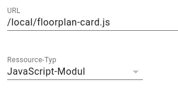
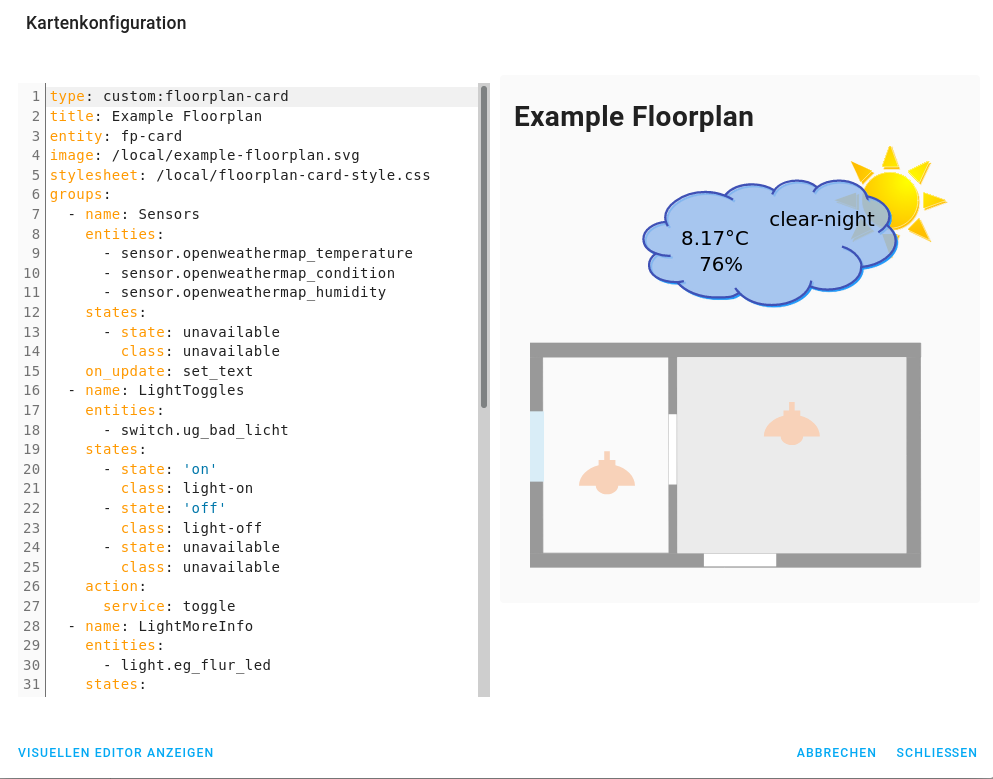

# floorplan-card
This is a card for [Lovelace](https://www.home-assistant.io/lovelace) on [Home Assistant](https://www.home-assistant.io/)
which allows to dynamically render an SVG graphic, for example for a floorplan.
It shows the live status of all the devices at home on one glance as in the following screenshot from the Home
Assistant interface:


The individual elements of the SVG drawing can be configured to react on clicks. For example the lights in this
example can be switched on and off by clicking on them. For other elements without a particular action being defined
the corresponding entity info dialogue opens up:


For more details on the configuration see the yaml syntax in step 4 below.

This custom card is an alternative for the official
[picture-elements card](https://www.home-assistant.io/lovelace/picture-elements/) with a different workflow.

## Installation

Installation works as described in the [home-assistant documentation for custom cards](https://developers.home-assistant.io/docs/frontend/custom-ui/lovelace-custom-card/).

### Step 1: Get the code

Save the following files from this repository to `<config directory>/www/` on your Home Assistant instance:

- floorplan-card.js
- floorplan-card-style.js
- example-floorplan.svg (as an example picture)

(if you have recently added the www folder you will need to restart Home Assistant for the files to be picked up).

### Step 2: Activate the custom card

Open the dashboard where the floorplan should be added, open the edit mode and choose "Manage Resources" from the menu on the top right. Then add a javascript resource with the url `/local/floorplan-card.js` and the type `javascript module`:



### Step 3: Add an SVG drawing

Create an SVG file, e.g. with a floorplan as in `example-floorplan.svg`. For this
[Inkscape](https://inkscape.org/en/develop/about-svg/) can be used.
For each Home Assistant entity to be displayed on the floorplan,
create one svg element (e.g. a rectangle, text or group).
Then set the `id` of this element to the full entity id of
Home Assistant.

In the markup code of the svg file, this would for example look like
(only opening tag):
```svg
<g id="switch.example_switch" transform="translate(2.1166667,-3.7041667)">
```

### Step 4: Configure the custom card

In the dashboard add a new card of type "Custom: Floorplan Card`. 
In its settings dialogue define all entities which should be styled in the svg picture.



The styles can be specified with css classes and also a "toggle" action for
lights is supported. Styles can be added or finetuned by adjusting the `floorplan-card-style.css` file. Sensor values can be printed into the svg picture with the "set_text" option.

Here is an example of a configuration with all supported functionalities:

```yaml
type: 'custom:floorplan-card'
title: Example Floorplan
entity: fp-card
image: /local/example-floorplan.svg
stylesheet: /local/floorplan-card-style.css

groups:
  # Example for sensor's. Their current value and if applicable unit
  # of measurement will replace the text inside the corresponding
  # svg elements.
  - name: Sensors
    entities:
      - sensor.openweathermap_temperature
      - sensor.openweathermap_condition
      - sensor.openweathermap_humidity
    on_update: 'set_text'

  # Example for lights with "toggle" feature. 
  # Svg elements with their name will be styled
  # according to the mentioned class as it is specified in the
  # css file.
  # In addition the lights can be switched on and off by clicking
  # on them or by tapping on them in case of a touchscreen.
  - name: LightToggles
    entities:
       - switch.ug_bad_licht
    states:
      - state: 'on'
        class: 'light-on'
      - state: 'off'
        class: 'light-off'
    action:
      service: toggle

  # Example for lights with info dialogue. 
  # Svg elements with their name will be styled
  # according to the mentioned class as it is specified in the
  # css file.
  # When clicking or tapping on them the "more info" dialogue opens.
  - name: LightMoreInfo
    entities:
       - light.eg_flur_led
    states:
      - state: 'on'
        class: 'light-on'
      - state: 'off'
        class: 'light-off'

  # Example for window sensors. Svg elements with their name will be styled
  # according to the mentioned class as it is specified in the
  # css file.
  - name: Windows
    entities:
      - binary_sensor.ug_hobby_fenster
    states:
      - state: 'off'
        class: 'info-background'
      - state: 'on'
        class: 'open-window'

  # Example for movement detection. Svg elements with their name will be styled
  # according to the mentioned class as it is specified in the
  # css file.
  - name: Movement
    entities:
      - binary_sensor.ug_hobby_bwm2
    states:
      - state: 'on'
        class: 'movement-bg'
```

A full example config is contained in [example-floorplan.yaml](example-floorplan.yaml).

## Troubleshooting

If something doesn't work, the issue may be within the SVG file. For example sometimes the element IDs are not set entirely correctly. For debugging open the browser's developer tools (`F12` in Chrome or Firefox) and watch out for warning messages in the javascript console when reloading the dashboard.

## Alternatives
This custom card was originally written as a replacement for [ha-floorplan](https://github.com/pkozul/ha-floorplan) when it stopped working with a new UI version. There is an updated and extended version of it by now which you may want to use as alternative: https://github.com/ExperienceLovelace/ha-floorplan.
