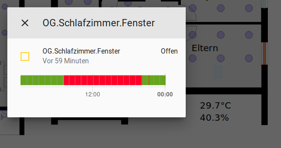

# floorplan-card
This is a card for [Lovelace](https://www.home-assistant.io/lovelace) on [Home Assistant](https://www.home-assistant.io/)
which allows to dynamically render an SVG graphic, for example for a floorplan.
It shows the live status of all the devices at home on one glance as in the following screenshot from the Home
Assistant interface:


The individual elements of the SVG drawing can be configured to react on clicks. For example the lights in this
example can be switched on and off by clicking on them. For other elements without a particular action being defined
the corresponding entity info dialogue opens up:



For more details on the configuration see the yaml syntax in step 4 below.

This custom card is an alternative for the official
[picture-elements card](https://www.home-assistant.io/lovelace/picture-elements/) and a replacement for pkozul's
great [ha-floorplan](https://github.com/pkozul/ha-floorplan) which sadly no longer works under the new Lovelace UI.

## Installation

### Step 1: Get the code

Save the following files from this repository to `<config directory>/www/` on your Home Assistant instance:

- floorplan-card.js
- floorplan-card-style.js
- example-floorplan.svg


### Step 2: Activate the custom card

Link `floorplan-card` inside your `ui-lovelace.yaml` (or in the 'raw configuration' in the UI).

```yaml
resources:
  - url: /local/floorplan-card.js
    type: js
```


### Step 3: Add an SVG drawing

Create an SVG file, e.g. with a floorplan. For this, for example
[Inkscape](https://inkscape.org/en/develop/about-svg/) can be used.
For each Home Assistant entity to be displayed on the floorplan,
create one svg element (e.g. a rectangle, text or group).
Then set the `id` of this element to the full entity id of
Home Assistant.

In the markup code of the svg file, this would for example look like
(only opening tag):
```svg
<g id="switch.example_switch" inkscape:label="#g77286" transform="translate(2.1166667,-3.7041667)">
```


### Step 4: Configure the custom card

Add a custom element in your `ui-lovelace.yaml` or add it via the UI editor.
Then define all entities which should be styled in the svg picture.
Their styles can be specified with css classes and also a "toggle" action for
lights is supported.
Sensor values can be printed into the svg picture.

Here is an example of a configuration with all supported functionalities:

```yaml
type: 'custom:floorplan-card'
title: Example Floorplan
entity: fp_example
image: /local/example-floorplan.svg
stylesheet: /local/floorplan-card-style.css

groups:
  # Example for sensor's. Their current value and if applicable unit
  # of measurement will replace the text inside the corresponding
  # svg elements.
  - name: Sensors
    entities:
      - sensor.owm_temperature
      - sensor.owm_cloud_coverage
      - sensor.owm_humidity
    on_update: 'set_text'

  # Example for lights. Svg elements with their name will be styled
  # according to the mentioned class as it is specified in the
  # css file.
  # In addition the lights can be switched on and off by clicking
  # on them or by tapping on them in case of a touchscreen.
  - name: LightSwitches
    entities:
       - switch.sample_switch
       - light.sample_light
    states:
      - state: 'on'
        class: 'light-on'
      - state: 'off'
        class: 'light-off'
    action:
      service: toggle

  # Example for window sensors. Svg elements with their name will be styled
  # according to the mentioned class as it is specified in the
  # css file.
  - name: Windows
    entities:
      - binary_sensor.sample_windows
    states:
      - state: 'off'
        class: 'info-background'
      - state: 'on'
        class: 'open-window'

  # Example for movement detection. Svg elements with their name will be styled
  # according to the mentioned class as it is specified in the
  # css file.
  - name: Movement
    entities:
      - binary_sensor.sample_pir
    states:
      - state: 'on'
        class: 'movement-bg'
```

A full example config is contained in [example-floorplan.yaml](example-floorplan.yaml).


## Replacing ha-floorplan
This custom card was written as a replacement for [ha-floorplan](https://github.com/pkozul/ha-floorplan).
It focuses on the core functionality though.
So if you only use ha-floorplan for assigning state-dependent css classes e.g. to
assign a different color to opened or closed windows or illuminated lights or to
print sensor values onto the picture, you can use this custom card as a drop-in replacement.
Simply take your floorplan/svg file and the css styles. The configuration might be
needed to adjusted slightly, but most things should stay the same.
One shortcomming is that jinja template literals are not supported. Instead
you have to use 'on_update: set_text' tags in the yaml file.
